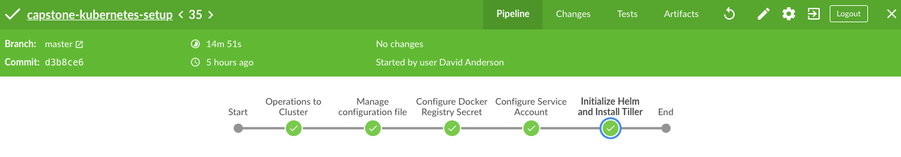

# About project

This project is part of the Udacity Nanodegree Program "Cloud DevOps Engineer". The objective is going to deploy an API using blue-green strategy directly on Kubernetes.

This repository contain all code required to deploy and setup a Kubernetes Cluster, after run this, you will able to deploy the [Capstone API](https://github.com/davidasrocha/capstone-api-grandmother-recipes) over this Kubernetes Cluster.

You can run this project using [Minikube](./docs/how-to-run-in-minikube.md) or [AWS EKS](how-to-run-in-aws.md).

## Jenkins Pipeline

There is a Jenkins Pipeline, to use this in Continuous Delivery, you need [read this doc](./docs/how-to-execute-pipeline.md).

