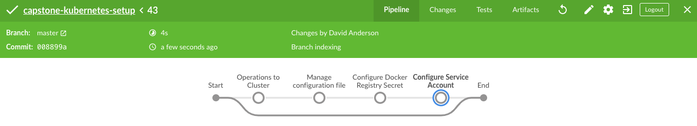

You need to have configure some resources to execute correctly this pipeline in Jenkins.

## Requirements

* [Jenkins AWS Pipeline](https://github.com/jenkinsci/pipeline-aws-plugin)

## How to execute

First, you need to create a new credential `AWS_DEVOPS` using AWS User Credentials.

Second, you have a S3 Bucket named `capstone-cicd-storage-eks-configs` in `us-west-2` region.

Third, you need to connect your Jenkins with your SCM. After configure it, the first pipeline execution will index the branch and present for you a screen similar.

Finally, you can start a pipeline to `create`, `delete` or `update` your cluster.

